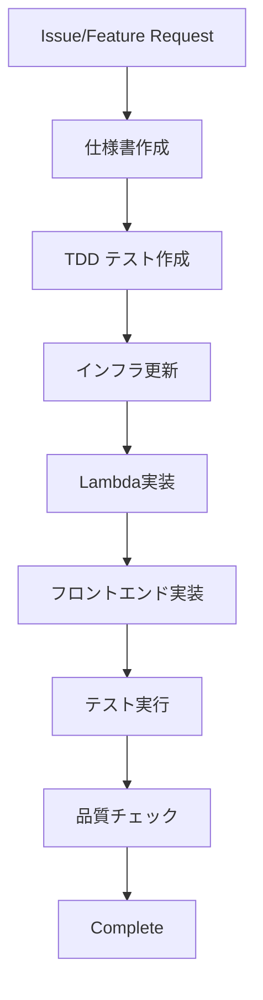

# Contributing to Career.fm

Career.fm は音声名刺サービスです。このプロジェクトへの貢献を歓迎します。

## 🤖 For AI Agents

このセクションは AI エージェント（Cursor、Claude など）が効率的に開発を進行するためのガイドです。

### 📋 Development Process Flow



### 🎯 Step-by-Step Implementation Guide

#### 1. 仕様書作成 (`docs/specs/`)
```bash
# ファイル名: F-XX-feature-name.md
# 例: F-05-audio-upload-optimization.md
```

**必須セクション:**
- Summary: 機能の概要
- User Stories: ユーザーストーリー
- AWS Services: 利用するAWSサービス
- API Specification: Lambda + API Gateway仕様
- CDK Changes: インフラ変更点
- Acceptance Criteria: 受け入れ基準

#### 2. TDD テスト作成 (`tests/`)
```typescript
// Lambda function testing
describe('Audio Upload Handler', () => {
  const ddbMock = mockClient(DynamoDBClient);
  const s3Mock = mockClient(S3Client);

  beforeEach(() => {
    ddbMock.reset();
    s3Mock.reset();
  });

  test('should generate presigned URL', async () => {
    // Arrange
    const event = createAPIGatewayEvent({
      body: JSON.stringify({ fileName: 'test.mp3' })
    });
    
    s3Mock.on(PutObjectCommand).resolves({});
    
    // Act
    const result = await handler(event);
    
    // Assert
    expect(result.statusCode).toBe(200);
    expect(JSON.parse(result.body)).toHaveProperty('presignedUrl');
  });
});
```

#### 3. インフラ更新 (`infrastructure/lib/stacks/`)
```typescript
// AWS CDK Stack updates
export class ApiStack extends Stack {
  constructor(scope: Construct, id: string, props: ApiStackProps) {
    super(scope, id, props);

    // New Lambda function
    const newFeatureFunction = new lambda.Function(this, 'NewFeatureFunction', {
      runtime: lambda.Runtime.NODEJS_18_X,
      handler: 'newFeature.handler',
      code: lambda.Code.fromAsset('../packages/backend/dist'),
      environment: {
        TABLE_NAME: props.audioCardTable.tableName,
        BUCKET_NAME: props.audioBucket.bucketName,
      },
    });

    // API Gateway integration
    const newResource = this.api.root.addResource('new-feature');
    newResource.addMethod('POST', new apigateway.LambdaIntegration(newFeatureFunction));
  }
}
```

#### 4. Lambda実装 (`packages/backend/`)
```typescript
// Lambda function implementation
import { APIGatewayEvent, APIGatewayProxyResult } from 'aws-lambda';
import { DynamoDBClient } from '@aws-sdk/client-dynamodb';
import { S3Client } from '@aws-sdk/client-s3';

const dynamoClient = new DynamoDBClient({ region: process.env.AWS_REGION });
const s3Client = new S3Client({ region: process.env.AWS_REGION });

export const handler = async (event: APIGatewayEvent): Promise<APIGatewayProxyResult> => {
  try {
    // Implementation logic
    return {
      statusCode: 200,
      headers: {
        'Content-Type': 'application/json',
        'Access-Control-Allow-Origin': '*',
      },
      body: JSON.stringify({ success: true })
    };
  } catch (error) {
    console.error('Error:', error);
    return {
      statusCode: 500,
      body: JSON.stringify({ error: 'Internal server error' })
    };
  }
};
```

#### 5. フロントエンド実装 (`packages/frontend/`)
```typescript
// Next.js API route or React component
import { useState } from 'react';
import { useAuth } from '../hooks/useAuth';

export const NewFeatureComponent: FC = () => {
  const { user, getIdToken } = useAuth();
  const [loading, setLoading] = useState(false);

  const handleFeatureAction = async () => {
    setLoading(true);
    try {
      const token = await getIdToken();
      const response = await fetch('/api/new-feature', {
        method: 'POST',
        headers: {
          'Authorization': `Bearer ${token}`,
          'Content-Type': 'application/json',
        },
        body: JSON.stringify({ data: 'example' })
      });
      
      const result = await response.json();
      // Handle success
    } catch (error) {
      console.error('Error:', error);
    } finally {
      setLoading(false);
    }
  };

  return (
    <button onClick={handleFeatureAction} disabled={loading}>
      {loading ? 'Processing...' : 'Execute Feature'}
    </button>
  );
};
```

### 🛠️ Code Quality Checklist

実装完了前に以下を確認：

- [ ] TypeScript コンパイルエラーなし (`npm run build`)
- [ ] Jest テストが通る (`npm test`)
- [ ] CDK テストが通る (`npm run test:cdk`)
- [ ] ESLint エラーなし (`npm run lint`)
- [ ] CDK diff チェック (`npm run cdk:diff`)
- [ ] AWS 認証情報の設定確認
- [ ] Lambda function のメモリ・タイムアウト設定
- [ ] DynamoDB アクセスパターンの最適化確認

### 📁 File Path Templates

新機能追加時の標準的なファイルパス：

```
docs/specs/F-XX-feature-name.md                    # 仕様書
infrastructure/lib/stacks/feature-stack.ts         # CDK Stack (必要時)
packages/backend/src/functions/feature/            # Lambda Functions
packages/backend/src/shared/feature/               # Shared utilities
packages/frontend/src/components/feature/          # React Components
packages/frontend/src/pages/api/feature/           # Next.js API Routes
tests/backend/feature/                              # Backend tests
tests/frontend/feature/                             # Frontend tests
tests/infrastructure/feature-stack.test.ts         # CDK tests
```

詳細なモジュール構成は [docs/ARCHITECTURE.md](docs/ARCHITECTURE.md) を参照してください。

### 🚨 Common Pitfalls for AI Agents

**避けるべき実装パターン:**

1. **AWS認証情報のハードコード**
   ```typescript
   // ❌ 悪い例
   const config = {
     accessKeyId: 'AKIA...',
     secretAccessKey: 'secret...',
   };
   
   // ✅ 良い例 - IAM ロールを使用
   const dynamoClient = new DynamoDBClient({
     region: process.env.AWS_REGION
   });
   ```

2. **Lambda Cold Start対策なし**
   ```typescript
   // ❌ 悪い例 - 毎回新しい接続
   export const handler = async (event) => {
     const client = new DynamoDBClient({});
     // ...
   };
   
   // ✅ 良い例 - 接続を再利用
   const client = new DynamoDBClient({});
   export const handler = async (event) => {
     // Use shared client
   };
   ```

3. **DynamoDBの非効率なクエリ**
   ```typescript
   // ❌ 悪い例 - Scan操作
   const result = await client.send(new ScanCommand({
     TableName: TABLE_NAME,
     FilterExpression: 'userId = :userId'
   }));
   
   // ✅ 良い例 - Query操作
   const result = await client.send(new QueryCommand({
     TableName: TABLE_NAME,
     KeyConditionExpression: 'PK = :pk',
     ExpressionAttributeValues: {
       ':pk': `USER#${userId}`
     }
   }));
   ```

4. **S3アクセスの非最適化**
   ```typescript
   // ❌ 悪い例 - 直接アップロード
   const upload = await s3Client.send(new PutObjectCommand({
     Bucket: BUCKET_NAME,
     Key: fileName,
     Body: fileBuffer
   }));
   
   // ✅ 良い例 - Presigned URL
   const presignedUrl = await getSignedUrl(s3Client, new PutObjectCommand({
     Bucket: BUCKET_NAME,
     Key: fileName,
     ContentType: 'audio/mp3'
   }), { expiresIn: 3600 });
   ```

### 🔄 Testing Strategy

#### Unit Testing (Lambda)
```bash
npm run test:backend          # Jest backend tests
npm run test:backend:watch    # Watch mode
npm run test:backend:coverage # Coverage report
```

#### Infrastructure Testing (CDK)
```bash
npm run test:cdk             # CDK infrastructure tests
npm run cdk:diff             # Show infrastructure changes
npm run cdk:synth            # Synthesize CloudFormation
```

#### Integration Testing
```bash
npm run test:integration     # API integration tests
npm run test:e2e            # End-to-end tests
```

#### AWS Local Testing
```bash
npm run sam:local           # SAM local testing
npm run dynamodb:local      # Local DynamoDB
npm run s3:local            # Local S3 (LocalStack)
```

### 📚 Reference Documentation

- [プロダクト要件定義](docs/prd.md)
- [システムアーキテクチャ](docs/ARCHITECTURE.md)
- [システム要件](docs/requirements.md)
- [実装計画](docs/implementation-plan.md)
- [AWS アーキテクチャ決定](decisions/0001-aws-serverless-architecture.md)

## 👥 For Human Contributors

### Prerequisites
- Node.js 18+
- npm
- AWS CLI
- AWS CDK CLI (`npm install -g aws-cdk`)
- Git

### AWS Setup
```bash
# AWS CLI configuration
aws configure
# または
aws configure sso

# CDK Bootstrap (初回のみ)
npx cdk bootstrap
```

### Project Setup
```bash
git clone https://github.com/your-username/careerfm.git
cd careerfm
npm install

# Install dependencies for all packages
npm run install:all

# Build the project
npm run build
```

### Development Workflow

#### 1. Infrastructure Development
```bash
cd infrastructure
npm run build                # TypeScript compile
npm run test                 # Run CDK tests
npm run cdk:diff             # Preview changes
npm run cdk:deploy           # Deploy to AWS
```

#### 2. Backend Development
```bash
cd packages/backend
npm run build                # Compile TypeScript
npm run test                 # Run unit tests
npm run test:integration     # Integration tests
```

#### 3. Frontend Development
```bash
cd packages/frontend
npm run dev                  # Start development server
npm run build                # Production build
npm run test                 # Run tests
```

### AWS Deployment

#### Development Environment
```bash
npm run deploy:dev           # Deploy to dev environment
npm run test:dev             # Test against dev APIs
```

#### Staging Environment
```bash
npm run deploy:staging       # Deploy to staging
npm run test:staging         # Staging tests
```

#### Production Environment
```bash
npm run deploy:prod          # Production deployment
npm run test:prod            # Production smoke tests
```

### Git Workflow
1. Feature ブランチを作成
2. 仕様書 → テスト → インフラ → 実装の順で開発
3. CDK diff で変更を確認
4. テストが通ることを確認
5. Pull Request 作成

## 📝 Documentation Standards

### コミットメッセージ
```
feat(api): F-XX 新しいLambda関数を追加
fix(frontend): F-XX 音声アップロードのバグ修正
infra(cdk): F-XX DynamoDB インデックスを追加
test: F-XX テストケースの追加
docs: アーキテクチャドキュメントの更新
```

### Pull Request
- 関連する Issue 番号を記載
- CDK diff の結果を添付
- インフラ変更時はコスト影響を記載
- テストが通ることを確認
- レビュワーを指定

## 🎵 Audio Development Guidelines

### S3 Audio Storage Best Practices
- **ファイル構造**: `audio/{userId}/{cardId}/`
- **命名規則**: `original.mp3`, `optimized.mp3`
- **暗号化**: S3 Server-Side Encryption (SSE-S3)
- **アクセス**: Presigned URL for uploads, CloudFront for downloads

### Lambda Audio Processing
```typescript
// S3 trigger for audio processing
export const processAudioHandler = async (event: S3Event) => {
  for (const record of event.Records) {
    const bucket = record.s3.bucket.name;
    const key = record.s3.object.key;
    
    // Process only audio files
    if (!isAudioFile(key)) continue;
    
    try {
      // Generate optimized version
      await optimizeAudio(bucket, key);
      
      // Extract metadata
      const metadata = await extractAudioMetadata(bucket, key);
      
      // Update DynamoDB
      await updateAudioCard(getCardIdFromKey(key), metadata);
      
    } catch (error) {
      console.error(`Failed to process ${key}:`, error);
      // Send to DLQ for retry
    }
  }
};
```

## 🔐 Security Guidelines

### Cognito Authentication
- JWT token validation in Lambda authorizers
- Proper scope management
- Refresh token rotation

### S3 Security
- Bucket public access blocked
- Presigned URLs with expiration
- Object-level permissions

### DynamoDB Security
- Least privilege IAM policies
- Attribute-based access control
- Encryption at rest

### Lambda Security
```typescript
// Environment variable validation
const validateEnvironment = () => {
  const required = ['TABLE_NAME', 'BUCKET_NAME', 'USER_POOL_ID'];
  for (const env of required) {
    if (!process.env[env]) {
      throw new Error(`Missing required environment variable: ${env}`);
    }
  }
};

// Input validation
const validateInput = (event: APIGatewayEvent) => {
  const schema = Joi.object({
    fileName: Joi.string().required(),
    contentType: Joi.string().valid('audio/mp3', 'audio/wav', 'audio/m4a')
  });
  
  return schema.validate(JSON.parse(event.body || '{}'));
};
```

## 🚀 Performance Guidelines

### Lambda Optimization
- Connection pooling for DynamoDB/S3
- Appropriate memory allocation
- Cold start mitigation strategies

### DynamoDB Optimization
- Single table design
- Efficient access patterns
- Proper indexing strategy

### Audio Delivery Optimization
- CloudFront for global distribution
- Appropriate caching headers
- Progressive loading implementation

## 📊 Monitoring & Debugging

### CloudWatch Logs
```bash
# View Lambda logs
aws logs tail /aws/lambda/careerfm-api-dev-CardFunction --follow

# Search logs
aws logs filter-log-events \
  --log-group-name /aws/lambda/careerfm-api-dev-CardFunction \
  --filter-pattern "ERROR"
```

### X-Ray Tracing
- Lambda functions have X-Ray tracing enabled
- Trace API Gateway → Lambda → DynamoDB flows
- Monitor performance bottlenecks

### Custom Metrics
```typescript
// Custom CloudWatch metrics
import { CloudWatch } from '@aws-sdk/client-cloudwatch';

const cloudwatch = new CloudWatch({});

export const putMetric = async (metricName: string, value: number) => {
  await cloudwatch.putMetricData({
    Namespace: 'CareerFM/API',
    MetricData: [{
      MetricName: metricName,
      Value: value,
      Unit: 'Count',
      Timestamp: new Date()
    }]
  });
};
```

## 🆘 Getting Help

- [GitHub Issues](https://github.com/your-username/careerfm/issues)
- [Discussions](https://github.com/your-username/careerfm/discussions)
- [AWS Documentation](https://docs.aws.amazon.com/)
- [AWS CDK Documentation](https://docs.aws.amazon.com/cdk/)
- [AWS Lambda Best Practices](https://docs.aws.amazon.com/lambda/latest/dg/best-practices.html)

## 📄 License

MIT License - 詳細は [LICENSE](LICENSE) を参照
