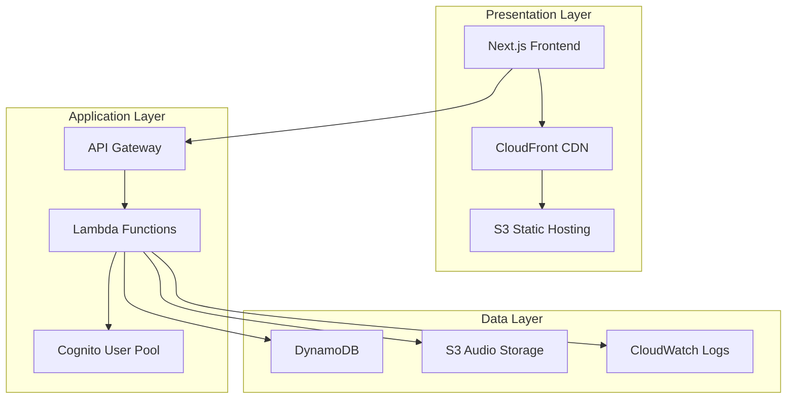
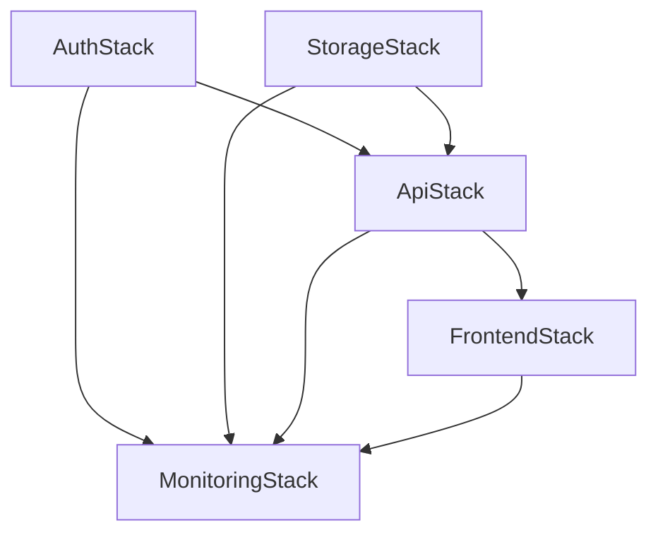
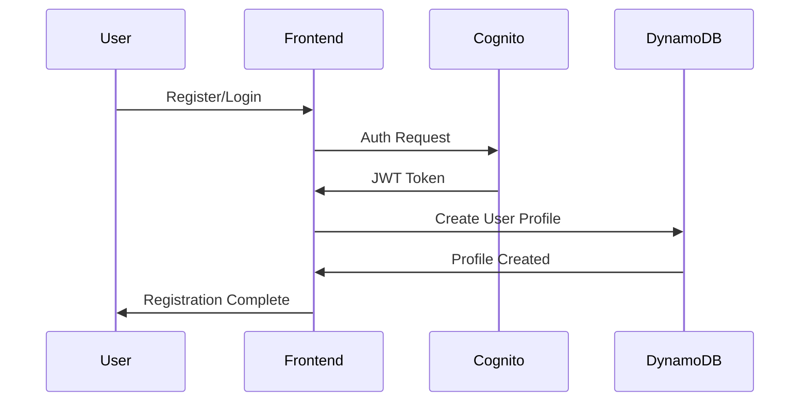
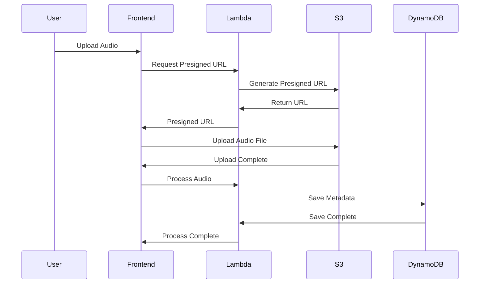
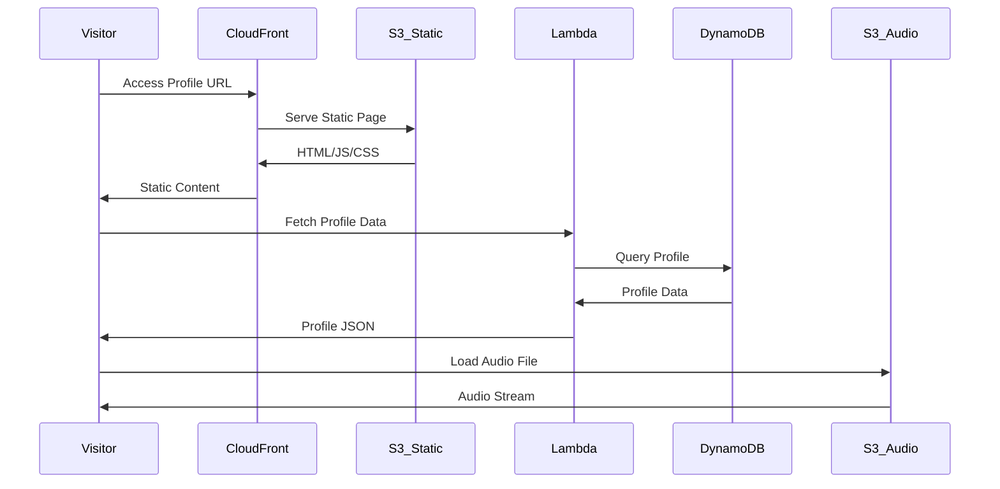

# Career.fm Architecture

## 🏗️ System Overview

Career.fm は**音声プロフィール生成・公開・共有**の AWS サーバーレスアーキテクチャで構築された音声名刺サービスです。



## 🧠 Design Philosophy

### Core Principles

| 原則 | 説明 | 実装への影響 |
|------|------|-------------|
| **簡単操作** | "Upload, Profile, Share" | 3ステップで音声名刺が完成 |
| **高品質音声** | 音声ファイルの最適化と高速配信 | S3 + CloudFront による配信最適化 |
| **拡張性** | 新機能の容易な追加 | サーバーレス・マイクロサービス設計 |
| **型安全** | 実行時エラーの最小化 | TypeScript + AWS CDK による厳密な型定義 |

### Architectural Decisions

#### 1. AWS Serverless Design
**決定**: AWS Lambda + API Gateway + DynamoDB によるサーバーレスアーキテクチャ

**理由**:
- 初期コストの最小化（従量課金）
- 自動スケーリングとメンテナンスフリー
- AWS エコシステムとの統合

#### 2. Cognito Authentication
**決定**: AWS Cognito User Pool による認証・認可

**理由**:
- セキュアな認証基盤
- OAuth プロバイダー統合
- JWT トークンによる API 認証

#### 3. S3 + CloudFront Audio Delivery
**決定**: S3 ストレージ + CloudFront CDN による音声配信

**理由**:
- グローバルな高速配信
- 大容量ファイルの効率的な処理
- Presigned URL による安全なアップロード

## 📁 AWS CDK Stack Architecture

### Stack Structure

```typescript
infrastructure/
├── lib/
│   ├── stacks/
│   │   ├── auth-stack.ts          # Cognito User Pool
│   │   ├── storage-stack.ts       # DynamoDB + S3
│   │   ├── api-stack.ts           # API Gateway + Lambda
│   │   ├── frontend-stack.ts      # CloudFront + S3
│   │   └── monitoring-stack.ts    # CloudWatch + Alarms
│   └── types/
│       └── index.ts              # CDK Types
└── bin/
    └── infrastructure.ts         # CDK App Entry
```

### Stack Dependencies



## 🔄 Data Flow Architecture

### User Registration Flow



### Audio Upload Flow



### Profile Sharing Flow



## 🎵 Audio Architecture

### S3 Audio Storage Structure

```
careerfm-audio-{stage}-{account}/
├── audio/
│   ├── {userId}/
│   │   ├── {cardId}/
│   │   │   ├── original.mp3        # Original upload
│   │   │   ├── optimized.mp3       # Optimized version
│   │   │   └── thumbnail.jpg       # Audio waveform image
│   │   └── profile/
│   │       └── avatar.jpg          # Profile image
│   └── public/
│       └── {cardId}.mp3           # Public accessible files
└── temp/
    └── {uploadId}/                # Temporary upload staging
```

### Audio Processing Pipeline

```typescript
// Audio upload and processing flow
interface AudioProcessingPipeline {
  generatePresignedUrl: (userId: string, fileName: string) => Promise<PresignedUrl>;
  validateUpload: (s3Event: S3Event) => Promise<ValidationResult>;
  optimizeAudio: (audioKey: string) => Promise<OptimizedAudio>;
  generateMetadata: (audioKey: string) => Promise<AudioMetadata>;
  updateDatabase: (cardId: string, metadata: AudioMetadata) => Promise<void>;
}

// Lambda trigger configuration
interface S3TriggerConfig {
  event: 's3:ObjectCreated:*';
  filter: {
    prefix: 'audio/';
    suffix: ['.mp3', '.wav', '.m4a'];
  };
}
```

### Supported Audio Formats

| Format | Extension | Max Size | Quality | Processing |
|--------|-----------|----------|---------|------------|
| MP3 | .mp3 | 10MB | 128-320kbps | Direct |
| WAV | .wav | 10MB | Uncompressed | Convert to MP3 |
| M4A | .m4a | 10MB | AAC Encoded | Convert to MP3 |

## 📊 Data Models

### DynamoDB Table Design

```typescript
// AudioCard Table (Single Table Design)
interface AudioCardTable {
  PK: string;           // USER#{userId} | CARD#{cardId}
  SK: string;           // METADATA | AUDIO | SETTINGS
  GSI1PK?: string;      // PUBLIC#CARD | USER#{userId}
  GSI1SK?: string;      // {createdAt} | CARD#{cardId}
  
  // User Profile (PK: USER#{userId}, SK: METADATA)
  displayName?: string;
  title?: string;
  bio?: string;
  avatar?: string;
  socialLinks?: SocialLink[];
  
  // Audio Card (PK: CARD#{cardId}, SK: METADATA)
  cardId?: string;
  userId?: string;
  audioUrl?: string;
  audioMetadata?: AudioMetadata;
  isPublic?: boolean;
  createdAt?: string;
  updatedAt?: string;
}

// Access Patterns
interface AccessPatterns {
  getUserProfile: (userId: string) => Query;      // PK = USER#{userId}, SK = METADATA
  getUserCards: (userId: string) => Query;        // GSI1: PK = USER#{userId}
  getPublicCard: (cardId: string) => Query;       // PK = CARD#{cardId}, SK = METADATA
  listPublicCards: () => Query;                   // GSI1: PK = PUBLIC#CARD
}
```

### Cognito User Attributes

```typescript
// Standard Attributes
interface CognitoUserProfile {
  email: string;           // Required, verified
  email_verified: boolean;
  family_name?: string;
  given_name?: string;
  
  // Custom Attributes
  'custom:avatar'?: string;     // S3 URL to profile image
  'custom:bio'?: string;        // Short bio text
  'custom:title'?: string;      // Professional title
}
```

## 🔧 Lambda Functions Architecture

### Function Organization

```typescript
packages/backend/
├── src/
│   ├── functions/
│   │   ├── auth/              # Authentication handlers
│   │   │   ├── login.ts
│   │   │   ├── register.ts
│   │   │   └── refresh.ts
│   │   ├── users/             # User management
│   │   │   ├── profile.ts
│   │   │   └── settings.ts
│   │   ├── cards/             # Audio card operations
│   │   │   ├── create.ts
│   │   │   ├── read.ts
│   │   │   ├── update.ts
│   │   │   └── delete.ts
│   │   ├── upload/            # File upload handling
│   │   │   ├── presigned-url.ts
│   │   │   └── process-audio.ts
│   │   └── public/            # Public API endpoints
│   │       └── card-view.ts
│   ├── shared/                # Shared utilities
│   │   ├── database/
│   │   ├── storage/
│   │   ├── auth/
│   │   └── validation/
│   └── types/                 # TypeScript definitions
```

### Lambda Environment Variables

```typescript
// Common environment variables
interface LambdaEnvironment {
  STAGE: 'dev' | 'staging' | 'prod';
  REGION: string;
  USER_POOL_ID: string;
  TABLE_NAME: string;
  BUCKET_NAME: string;
  CORS_ORIGINS: string;           // JSON string of allowed origins
  LOG_LEVEL: 'debug' | 'info' | 'warn' | 'error';
}
```

## 🚀 Performance Optimizations

### Frontend Optimizations

1. **Next.js Optimizations**:
   - Automatic code splitting
   - Image optimization with Next/Image
   - Static generation for public profiles
   - Edge-side rendering with CloudFront

2. **Audio Loading Strategy**:
   ```typescript
   // Progressive audio loading
   const AudioPlayer: FC<AudioPlayerProps> = ({ audioUrl }) => {
     const [isLoaded, setIsLoaded] = useState(false);
     
     // Preload metadata only
     useEffect(() => {
       const audio = new Audio();
       audio.preload = 'metadata';
       audio.src = audioUrl;
       audio.addEventListener('loadedmetadata', () => setIsLoaded(true));
     }, [audioUrl]);
   };
   ```

### Backend Optimizations

1. **Lambda Cold Start Mitigation**:
   ```typescript
   // Shared connection pool
   const dynamodbClient = new DynamoDBClient({
     region: process.env.AWS_REGION,
     maxAttempts: 3,
   });
   
   // Connection reuse
   export const handler = async (event: APIGatewayEvent) => {
     // Handler logic using shared client
   };
   ```

2. **DynamoDB Query Optimization**:
   ```typescript
   // Efficient single-table queries
   const getUserCards = async (userId: string) => {
     return await dynamodbClient.send(new QueryCommand({
       TableName: TABLE_NAME,
       IndexName: 'UserCardsIndex',
       KeyConditionExpression: 'userId = :userId',
       ExpressionAttributeValues: {
         ':userId': userId
       },
       ScanIndexForward: false,  // Latest first
       Limit: 20                 // Pagination
     }));
   };
   ```

### Audio Delivery Optimizations

1. **S3 + CloudFront Configuration**:
   ```typescript
   const audioBucket = new s3.Bucket(this, 'AudioBucket', {
     cors: [{
       allowedHeaders: ['*'],
       allowedMethods: [s3.HttpMethods.GET, s3.HttpMethods.PUT],
       allowedOrigins: ['*'],
       exposedHeaders: ['ETag', 'Content-Length'],
     }]
   });
   
   const distribution = new cloudfront.Distribution(this, 'AudioCDN', {
     defaultBehavior: {
       origin: new origins.S3Origin(audioBucket),
       cachePolicy: cloudfront.CachePolicy.CACHING_OPTIMIZED,
       allowedMethods: cloudfront.AllowedMethods.ALLOW_GET_HEAD,
     }
   });
   ```

## 🔒 Security Architecture

### API Security

```typescript
// Cognito JWT Authorizer
const authorizer = new apigateway.CognitoUserPoolsAuthorizer(this, 'Authorizer', {
  cognitoUserPools: [userPool],
  identitySource: 'method.request.header.Authorization',
});

// Protected endpoint example
cardsResource.addMethod('POST', new apigateway.LambdaIntegration(cardFunction), {
  authorizer,
  authorizationType: apigateway.AuthorizationType.COGNITO,
});
```

### S3 Security

```typescript
// Bucket policy for secure access
const bucketPolicy = new iam.PolicyStatement({
  effect: iam.Effect.ALLOW,
  principals: [new iam.ServicePrincipal('lambda.amazonaws.com')],
  actions: ['s3:GetObject', 's3:PutObject'],
  resources: [`${audioBucket.bucketArn}/*`],
  conditions: {
    StringEquals: {
      's3:x-amz-server-side-encryption': 'AES256'
    }
  }
});

audioBucket.addToResourcePolicy(bucketPolicy);
```

### DynamoDB Security

```typescript
// IAM policies for least privilege access
const dynamoPolicy = new iam.PolicyStatement({
  effect: iam.Effect.ALLOW,
  actions: [
    'dynamodb:GetItem',
    'dynamodb:PutItem',
    'dynamodb:UpdateItem',
    'dynamodb:DeleteItem',
    'dynamodb:Query',
  ],
  resources: [audioCardTable.tableArn, `${audioCardTable.tableArn}/index/*`],
  conditions: {
    'ForAllValues:StringEquals': {
      'dynamodb:Attributes': [
        'PK', 'SK', 'userId', 'cardId', 'displayName', 'audioUrl'
      ]
    }
  }
});
```

## 📈 Monitoring & Observability

### CloudWatch Integration

```typescript
// Custom metrics for business logic
const apiMetrics = new cloudwatch.Dashboard(this, 'ApiDashboard', {
  widgets: [
    [
      new cloudwatch.GraphWidget({
        title: 'API Requests',
        left: [api.metricCount()],
        right: [api.metricLatency()],
      }),
    ],
    [
      new cloudwatch.GraphWidget({
        title: 'Audio Upload Success Rate',
        left: [uploadFunction.metricInvocations()],
        right: [uploadFunction.metricErrors()],
      }),
    ],
  ],
});

// Alarms for critical metrics
new cloudwatch.Alarm(this, 'HighErrorRate', {
  metric: api.metricServerError(),
  threshold: 10,
  evaluationPeriods: 2,
});
```

### X-Ray Tracing

```typescript
// Enable X-Ray tracing for Lambda functions
const tracingConfig: lambda.TracingConfig = {
  mode: lambda.Tracing.ACTIVE,
};

// Apply to all Lambda functions
const functions = [authFunction, userFunction, cardFunction, uploadFunction];
functions.forEach(fn => {
  fn.addToRolePolicy(new iam.PolicyStatement({
    actions: ['xray:PutTraceSegments', 'xray:PutTelemetryRecords'],
    resources: ['*'],
  }));
});
```

## 🧪 Testing Architecture

### CDK Testing

```typescript
// Infrastructure testing
import { Template } from 'aws-cdk-lib/assertions';
import { AuthStack } from '../lib/stacks/auth-stack';

test('Cognito User Pool Created', () => {
  const template = Template.fromStack(authStack);
  
  template.hasResourceProperties('AWS::Cognito::UserPool', {
    UserPoolName: 'careerfm-dev',
    SelfSignUpEnabled: true,
  });
});
```

### Lambda Testing

```typescript
// Function testing with AWS SDK mocks
import { mockClient } from 'aws-sdk-client-mock';
import { DynamoDBClient, GetItemCommand } from '@aws-sdk/client-dynamodb';

const ddbMock = mockClient(DynamoDBClient);

beforeEach(() => {
  ddbMock.reset();
});

test('getUserProfile returns user data', async () => {
  ddbMock.on(GetItemCommand).resolves({
    Item: {
      PK: { S: 'USER#123' },
      SK: { S: 'METADATA' },
      displayName: { S: 'Test User' },
    }
  });

  const result = await getUserProfile('123');
  expect(result.displayName).toBe('Test User');
});
```

---

## 📚 Related Documentation

- **Development Process**: [CONTRIBUTING.md](../CONTRIBUTING.md)
- **Product Requirements**: [prd.md](prd.md)
- **System Requirements**: [requirements.md](requirements.md)
- **Implementation Plan**: [implementation-plan.md](implementation-plan.md)
- **AWS Architecture Decision**: [../decisions/0001-aws-serverless-architecture.md](../decisions/0001-aws-serverless-architecture.md)